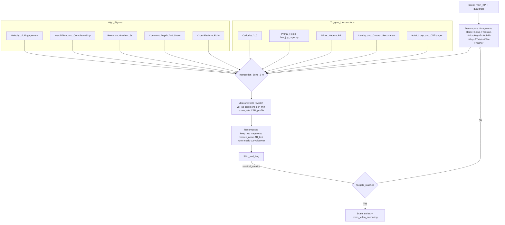
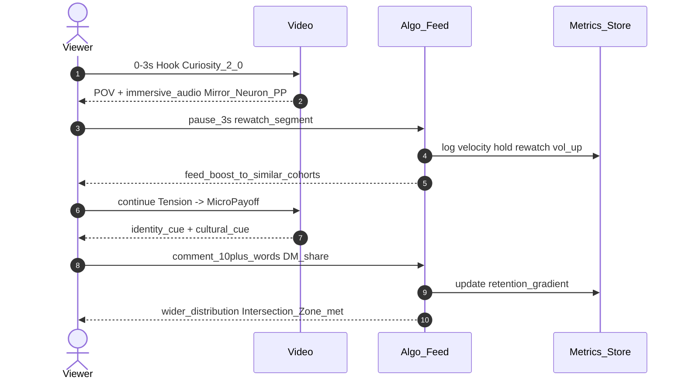
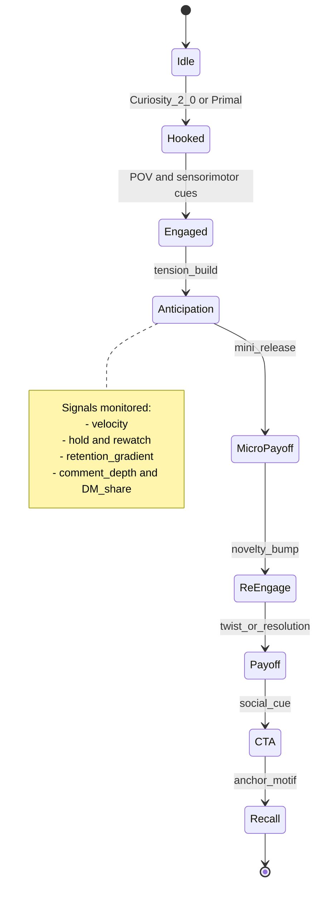
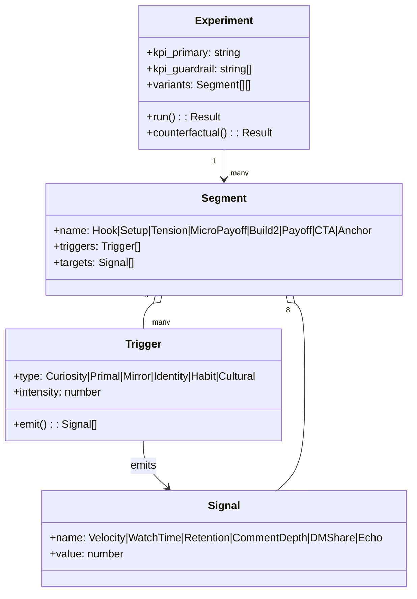

# Mermaid Diagrams — Intersection Upgrade v2.0

## 1) Flowchart — Intersection Zone 2.0 Pipeline

---

## 2) Sequence — Trigger → Behavior Signal → Algorithm Boost

---

## 3) Gantt — Timeline of 8 Functional Segments + KPI Windows

```mermaid
gantt
  title 8 Segment Timeline with KPI Windows
  dateFormat  ss
  axisFormat  %Ss

  section Segments
  Hook_0_3s            :done,    s0, 0, 3
  Setup_3_7s           :active,  s1, 3, 4
  Tension_7_to_X       :         s2, 7, 6
  MicroPayoff          :milestone, s3, 13, 1
  Build2               :         s4, 14, 6
  Payoff_Twist         :crit,    s5, 20, 4
  CTA_Soft             :         s6, 24, 3
  Anchor_Motif         :         s7, 27, 3

  section KPI_Windows
  Velocity_0_30s       :          k0, 0, 30
  Retention_Gradient   :          k1, 0, 30
  Comment_Depth_10p    :          k2, 10, 20
  DM_Share_Window      :          k3, 12, 25
```

---

## 4) State — Attention States & Transitions

---

## 5) Class — Component Interfaces

